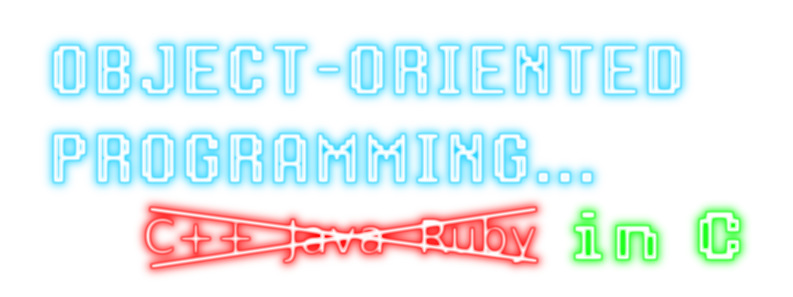

# Object-Oriented Programming in C

It is well-known that languages like C++, Java, and Ruby provide support for
Object-Oriented Programming (OOP). However, it may come as somewhat of a surpise
that OOP can also be done in C &mdash; with much discipline required. This
project demonstrates how to implement inheritance, polymorphism, and
encapsulation in C, drawing concepts and inspiration from the following sources:

1. Axel-Tobias Schreiner's book [_Object-Oriented Programming With ANSI-C_]
2. Michael Safyan's article [Object-Oriented Programming (OOP) in C]
3. Feeping Creature's invaluable blogpost [why single-inheritance
   multiple-interfaces oop is the most beautiful thing]

A result of much experimentation and many [segfaults], the final product is
something that looks and feels somewhat like Java.

See [demo.c](src/demo.c) for an example of classic, Java-like OOP.

## Building and Running

A C compiler such as [GCC] is required to build the demo.

Build and run:

```console
$ gcc -o demo src/*.c
$ ./demo
```

Output (memory addresses may vary):
```console
Creating Object.
Creating Boat.
Creating Car.
Creating Plane.

*Statically Dispatch on Object*
Object Address: 0x556128120270
Object String:  Object@0x556128120270
Object Hash:    93875772457584

*Dynamically Dispatch on Vehicle*
I am a Boat! I sail in the water.
I am a Car! I drive along the road.
I am a Plane! I fly in the air.

*Car*
Car  Address:    0x5561281202b0
Car  String:     Car[capacity=5, topSpeed=120, numberOfWheels=4]
Car  Hash:       93875772457648
Car  Capacity:   5
Car  Top Speed:  100
Car  # Wheels:   4
Car  Move:
  I am a Car! I drive along the road.

*Clone Car*
Creating Car.

*Car2 (Clone of Car)*
Car2 Address:    0x556128120370
Car2 String:     Car[capacity=5, topSpeed=120, numberOfWheels=4]
Car2 Hash:       93875772457840
Car2 Capacity:   5
Car2 Top Speed:  100
Car2 # Wheels:   4
Car Move:
  I am a Car! I drive along the road.

*Free Allocated Memory*
Deleting Object.
Deleting Boat.
Deleting Car.
Deleting Car.
Deleting Plane.
```

<!------------------------------------------------------------------------------
  Links
------------------------------------------------------------------------------->
[GCC]: https://gcc.gnu.org/
[_Object-Oriented Programming With ANSI-C_]: https://www.cs.rit.edu/~ats/books/ooc.pdf
[Object-Oriented Programming (OOP) in C]: https://www.codementor.io/@michaelsafyan/object-oriented-programming-in-c-du1081gw2
[segfaults]: https://en.wikipedia.org/wiki/Segmentation_fault
[why single-inheritance multiple-interfaces oop is the most beautiful thing]: https://feepingcreature.github.io/oop.html
