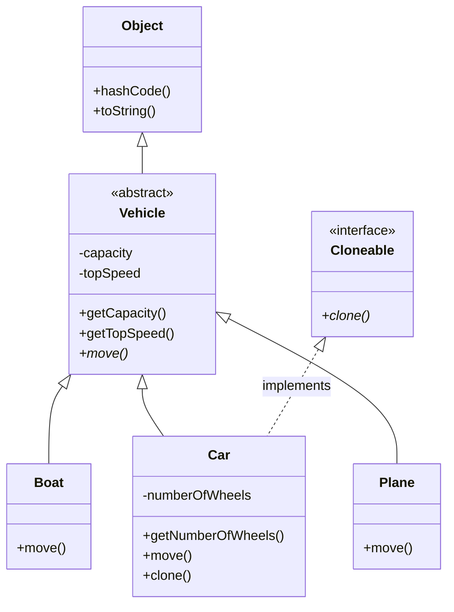

# Object-Oriented Programming in C

It is well-known that languages like C++, Java, and Ruby provide support for
Object-Oriented Programming (OOP). However, it may come as somewhat of a surpise
that OOP can also be done in C &mdash; with much discipline required. This
project demonstrates how to implement inheritance, polymorphism, and
encapsulation in C, drawing concepts and inspiration from the following sources:

1. Axel-Tobias Schreiner's book [_Object-Oriented Programming With ANSI-C_]
2. Michael Safyan's article [Object-Oriented Programming (OOP) in C]
3. Feeping Creature's invaluable blogpost [why single-inheritance
   multiple-interfaces oop is the most beautiful thing]

A result of much experimentation and many [segfaults], the final product is
something that looks and feels somewhat like Java.

See [demo.c](src/demo.c) for an example of classic, Java-like OOP.

## Building and Running

A C compiler such as [GCC] is required to build the demo.

Build and run with [GCC]:

```console
$ gcc -o demo src/*.c
$ ./demo
```

Build and run with [Make] + [GCC]:

```console
$ make
Built demo
$ ./demo
```

(To use a different compiler with Make, such as [Clang] or [MSVC], pass
`CC=clang` or `CC=cl` to the `make` command, respectively.)

Output (memory addresses may vary):
```console
Creating Object.
Creating Boat.
Creating Car.
Creating Plane.

*Statically Dispatch on Object*
Object Address: 0x556128120270
Object String:  Object@0x556128120270
Object Hash:    93875772457584

*Dynamically Dispatch on Vehicle*
I am a Boat! I sail in the water.
I am a Car! I drive along the road.
I am a Plane! I fly in the air.

*Car*
Car  Address:    0x5561281202b0
Car  String:     Car[capacity=5, topSpeed=120, numberOfWheels=4]
Car  Hash:       93875772457648
Car  Capacity:   5
Car  Top Speed:  100
Car  # Wheels:   4
Car  Move:
  I am a Car! I drive along the road.

*Clone Car*
Creating Car.

*Car2 (Clone of Car)*
Car2 Address:    0x556128120370
Car2 String:     Car[capacity=5, topSpeed=120, numberOfWheels=4]
Car2 Hash:       93875772457840
Car2 Capacity:   5
Car2 Top Speed:  100
Car2 # Wheels:   4
Car Move:
  I am a Car! I drive along the road.

*Free Allocated Memory*
Deleting Object.
Deleting Boat.
Deleting Car.
Deleting Car.
Deleting Plane.
```

## Class Hierarchy

_Disclaimer: This class hierarchy is obviously incomplete and less than useful
in a real codebase. It is intended primarily for research and instructional
purposes._

- At the root of the class hierachy is `Object` with `hashCode()` and
  `toString()` methods &mdash; based on Java's [`Object`].
- An abstract class, `Vehicle`, inherits from `Object`. `Vehicle` adds fields
  `capacity` and `topSpeed` with getters to access them, as well as an abstract
  method, `move()`.
- `Boat`, `Car`, and `Plane` all inherit from `Vehicle`, implementing the
  abstract method `move()`.
- `Car` adds an additional field &mdash; `numberOfWheels` &mdash; with a getter
  to access it.
- There is one interface &mdash; `Cloneable` &mdash; which `Car` implements.



## Implementation

### Objects

The foundation of OOP is the organization of data and behavior together into
_objects_. We can achieve this in C using `struct`s with function pointers:

```c
typedef struct Car Car;

struct Car {
  int capacity;
  int topSpeed;
  int numberOfWheels;
  int (*getCapacity)(void *this);
  int (*getTopSpeed)(void *this);
  int (*getNumberOfWheels)(void *this);
  void (*move)(void *this);
};
```

This defines `Car` to be an object type consisting of

- _fields:_ `capacity`, `topSpeed`, and `numberOfWheels`
- _methods:_ `getCapacity()`, `getTopSpeed()`, `getNumberOfWheels()`, and
  `move()`

The first parameter of any method is `void *this` which is a pointer to the
_receiver_ (current instance). [^1]. We
use a `void` pointer so that subclass instances can also be passed without being
cast. This will become important when we get to inheritance below.

Next, we declare a function for each method (prefixed with `Car_` to denote that
they are related to `Car`):

```c
int Car_getCapacity(void *this);
int Car_getTopSpeed(void *this);
int Car_getNumberOfWheels(void *this);
void Car_move(void *this);
```

These functions can be implemented as follows:

```c
int Car_getCapacity(void *_this_) {
  Car *this = _this_;
  return this->capacity;
}

int Car_getTopSpeed(void *_this_) {
  Car *this = _this_;
  return this->topSpeed;
}

int Car_getNumberOfWheels(void *_this_) {
  Car *this = _this_;
  return this->numberOfWheels;
}

void Car_move(void *_this_) {
  puts("I am a Car! I drive along the road.");
}
```

Finally, we can _instantiate_ (create an instance of) `Car` as follows:

```c
Car *car = &(Car) {
  .capacity = 5,
  .topSpeed = 120,
  .numberOfWheels = 4,
  .getCapacity = Car_getCapacity,
  .getTopSpeed = Car_getTopSpeed,
  .getNumberOfWheels = Car_getNumberOfWheels,
  .move = Car_move,
};
```

Since `car` is a pointer, members are accessed with `->`. For fields, this looks
like `car->capacity`, `car->topSpeed`, and `car->numberOfWheels`, as in the
`Car_` functions above.

Methods can be called in one of two ways:

1. `Car_getCapacity(car)`, `Car_getTopSpeed(car)`, `Car_move(car)`, etc.
2. `car->getCapacity(car)`, `car->getTopSpeed(car)`, `car->move(car)`, etc.

Calling a method on a given instances is also known as _dispatching_ the method
on the instance. The first way is known as _static dispatch_ (because the
function is known at compile time) and the second as _dynamic dispatch_ (because
the actual function is looked up at runtime). Dynamic dispatch will become
important when we get to polymorphism below.

### Classes

What we have so far works. However, the downside is that whenever we want to
instantiate an object, we must assign all methods, and must take care to do so
correctly. This becomes more cumbersome as the number of methods increases. If
we always assign the same methods to a `Car` instance, we can define a function
to do this:

```c
Car *Car_new(int capacity, int topSpeed, int numberOfWheels) {
  return &(Car) {
    .capacity = capacity,
    .topSpeed = topSpeed,
    .numberOfWheels = numberOfWheels,
    .getCapacity = Car_getCapacity,
    .getTopSpeed = Car_getTopSpeed,
    .getNumberOfWheels = Car_getNumberOfWheels,
    .move = Car_move,
  };
}
```

Now `Car` can be instantiated like this:

```c
Car *car = Car_new(5, 120, 4);
```

Thus, `Car` is a _class_, or pattern for creating objects. Every instance of
`Car` has the same methods available to it. Only fields can vary between
instances.

There is only one problem with `Car_new`: it wastes memory, since every instance
of `Car` has a copy of the same function pointers. Why not store them all in a
single place so they can be shared? This leads us to the next concept.

#### Vtables

To conserve memory, we can extract the methods into a separate `struct` &mdash;
known as a _virtual method table_, or _vtable_ for short:

```c
typedef struct CarVtable CarVtable;

struct CarVtable {
  int (*getCapacity)(void *this);
  int (*getTopSpeed)(void *this);
  int (*getNumberOfWheels)(void *this);
  void (*move)(void *this);
};
```

Instead of function pointers, we include a single vtable pointer in `Car`:

```c
typedef struct Car Car;

struct Car {
  const CarVtable *vtable;
  int capacity;
  int topSpeed;
  int numberOfWheels;
};
```

Note that the vtable pointer is the first member. This convention allows us to
always know where the vtable is in any object.

To use the vtable, we need an instance of `CarVtable`. We choose to call it
`Car_vtable`:

```c
const CarVtable Car_vtable = {
  .getCapacity = Car_getCapacity,
  .getTopSpeed = Car_getTopSpeed,
  .getNumberOfWheels = Car_getNumberOfWheels,
  .move = Car_move,
};
```

`Car_vtable` is declared `const` so that it cannot change.

With the above changes, `Car` can be instantiated as follows:

```c
Car *car = &(Car) {
  .vtable = Car_vtable,
  .capacity = 5,
  .topSpeed = 120,
  .numberOfWheels = 4,
};
```

And dynamically dispatching a vtable method now requies two pointer dereferences
(`->`) instead of one:

```c
car->vtable->getCapacity(car);
car->vtable->move(car);
```

Therefore, vtables trade a little performance on each method call (two memory
fetches instead of one) for lower memory usage overall. This is a tradeoff we
are willing to make.

But what if we forget to assign `vtable`? That would be a [null pointer] error,
likely causing our program to crash:

```c
Car *car = &(Car) {
  .capacity = 5,
  .topSpeed = 120,
  .numberOfWheels = 4,
};

car->vtable->move(car); // vtable is null!
```

To prevent null pointer errors, rewrite `Car_new` to assign `vtable`:

```c
Car *Car_new(int capacity, int topSpeed, int numberOfWheels) {
  return &(Car) {
    .vtable = Car_vtable,
    .capacity = capcity,
    .topSpeed = topSpeed,
    .numberOfWheels = numberOfWheels,
  };
}
```

<!------------------------------------------------------------------------------
  Footnotes
------------------------------------------------------------------------------->
[^1]: Many languages use a keyword such as `this` or `self` for the receiver,
which is implicit (e.g., Smalltalk, Java, C++). In contrast, in languages like
Rust, Go, and Python, the receiver is explicitly specified as the first method
parameter. The implicit approach is a nice abstraction, and the explicit
approach shows the inner workings of method calls.

<!------------------------------------------------------------------------------
  Links
------------------------------------------------------------------------------->
[Clang]: https://clang.llvm.org/
[GCC]: https://gcc.gnu.org/
[Make]: https://www.gnu.org/software/make/
[MSVC]: https://visualstudio.microsoft.com/vs/features/cplusplus/
[null pointer]: https://en.wikipedia.org/wiki/Null_pointer
[`Object`]: https://docs.oracle.com/en/java/javase/17/docs/api///java.base/java/lang/Object.html
[_Object-Oriented Programming With ANSI-C_]: https://www.cs.rit.edu/~ats/books/ooc.pdf
[Object-Oriented Programming (OOP) in C]: https://www.codementor.io/@michaelsafyan/object-oriented-programming-in-c-du1081gw2
[segfaults]: https://en.wikipedia.org/wiki/Segmentation_fault
[why single-inheritance multiple-interfaces oop is the most beautiful thing]: https://feepingcreature.github.io/oop.html
